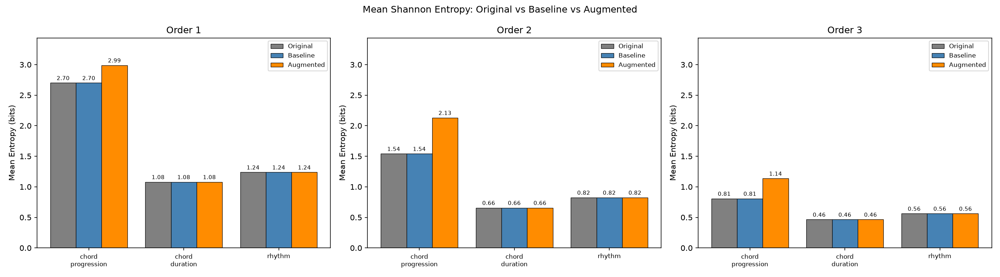
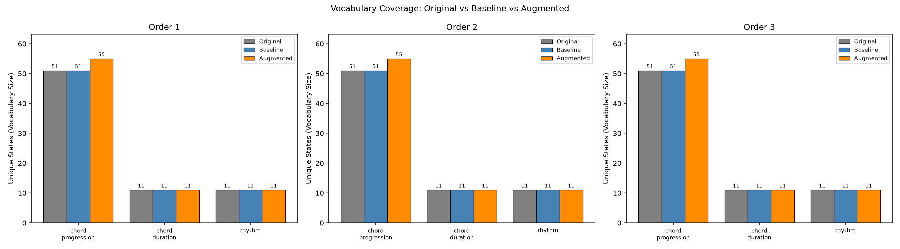
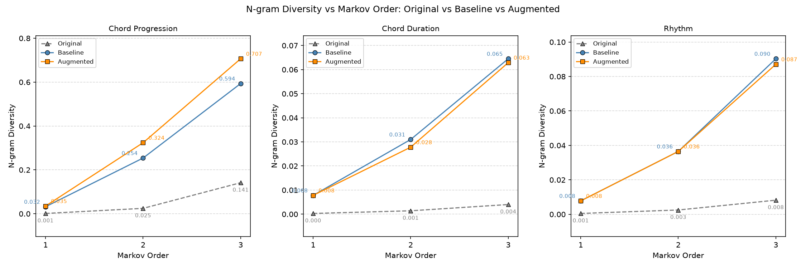

# Multidimensional Markov Music

A tool for generating symbolic music with Markov chains, plus a research
pipeline that tests whether transposing training data into every key helps
those chains generate more varied output.

## What's in this repo

Two separate things live here:

1. A desktop GUI (`main.py`) where you pick a dataset, train Markov models
   on it, generate a new piece, and play the result back as MIDI.
2. A research pipeline (`pipeline.py`) that trains models on the standard
   Bach chorale corpus, both with and without transposition augmentation,
   and measures the difference with entropy, vocabulary coverage, n-gram
   diversity, and Jensen-Shannon divergence.

## Why transposition augmentation

An n-th order Markov chain conditions on the last `n` symbols, so the
number of distinct contexts it has to learn grows fast with `n`. With a
few hundred chorales, an order-1 model still sees most chord transitions
many times, but an order-3 model splits the same data across far more
contexts and starts running out of examples for anything uncommon.
Van Der Merwe and Schulze (2011) identify this data sparsity as the main
limitation of Markov-chain music generation, and note that it gets worse
exactly as the order goes up, which is also where higher-order chains are
supposed to produce more coherent, less repetitive output.

Transposition augmentation is a way to test whether more training data
fixes this without changing what the model is learning: shifting a
chorale into a different key relabels its chords onto new roots but
keeps every harmonic relationship between them intact, so it multiplies
the corpus roughly 12x without inventing progressions that weren't
there. If the sparsity explanation is right, the augmented model's
advantage over the baseline should show up mainly at higher orders,
where the baseline is running out of data fastest. The results below
back that: the entropy gap between baseline and augmented essentially
triples from order 1 to order 3.

## How generation works

A song isn't modeled as one sequence. It's split into three independent
chains, trained and sampled separately:

- `chord_progression` (the harmony)
- `chord_duration` (how long each chord lasts)
- `rhythm`

Each chain is an n-th order Markov model (`features/markov.py`), so the
next symbol depends on the last `n` symbols instead of just the last one.
Generation samples all three chains and recombines them into a chord
sequence, which then gets rendered to a `.mid` file.

## Setup

Requires Python 3.10 or newer.

```
git clone <this repo>
cd multidimensional-markov-music
python -m venv venv
venv\Scripts\activate        # Windows
source venv/bin/activate     # macOS/Linux
pip install PyQt5 pygame music21 markovify matplotlib
```

## Generating and listening to music (GUI)

```
python main.py
```

1. Click **Select dataset** and point it at a folder under `Dataset/`
   (Bach, Haendel, Maestro, or Mozart), or your own MIDI/ABC files.
2. Click **Analyze dataset** to train the chord progression, chord
   duration, and rhythm models on it.
3. Click **Generate new music** to sample a new sequence from those
   models.
4. Click **Start MIDI Player**, open the generated `.mid` file, and press
   Play.

## Running the research pipeline

```
python pipeline.py --orders 1 2 3
```

By default this loads the 412-song Bach chorale corpus that ships with
`music21`. Pass `--dataset-path` to use a different folder of ABC or MIDI
files instead. For each order it:

1. Trains a baseline model on the corpus as-is.
2. Trains an augmented model on the same corpus transposed into all 12
   keys (music21's chorales are typically only in a handful of keys, so
   this multiplies the training data roughly 12x).
3. Generates sequences from both and scores them.

Output goes to `output/pipeline/` (`results.json` plus the three charts
below) and `output/generated_files/{baseline,augmented}/order_N/` (the
rendered `.mid` files, one per generated sequence, all at a fixed
1-quarter-note duration since chord duration is sampled from an
independent chain with no real timeline to inherit).

For a closer listening comparison, one that reconstructs real chord
durations and tempo from actual chorales instead of the flat placeholder
above, run:

```
python render_listening_comparison.py --orders 1 2 3
```

after the pipeline. It writes `output/generated_files/original/` (the
five reference chorales, unmodified) and `output/generated_files/improved/`
(the same generated chord progressions, voice-led into block chords and
paired with a real chorale's rhythm).

## Results

Seed 42, orders 1 to 3, the default 412-song Bach corpus.

| Order | Vocabulary (baseline / augmented) | Entropy, bits (baseline / augmented) | JS-divergence |
|-------|-----------------------------------|---------------------------------------|----------------|
| 1     | 51 / 55                           | 2.70 / 2.99                           | 0.121          |
| 2     | 51 / 55                           | 1.54 / 2.13                           | 0.121          |
| 3     | 51 / 55                           | 0.81 / 1.14                           | 0.121          |

Only `chord_progression` shows a gap. `chord_duration` and `rhythm` are
identical between baseline and augmented at every order, which is
expected: transposition only changes chord roots, not timing.







The entropy gap grows with order: at order 1 augmentation adds about
0.3 bits, at order 3 it adds about 0.33 bits on a much smaller base (0.81
vs. 2.70), a much larger relative gain. That lines up with the problem
Van Der Merwe and Schulze (2011) describe: higher-order chains split
their training data into more and smaller buckets, so they run out of
examples for rare transitions faster than low-order chains do.
Transposition augmentation gives each bucket more data to work with, and
the benefit is largest exactly where the sparsity problem is worst.

## Project layout

```
main.py                          GUI entry point
features/
  markov.py                      n-th order Markov chain implementation
  abc_parser.py                  loads ABC/MIDI corpora into chord/duration/rhythm sequences
  augmentation.py                transposition augmentation
  midi_export.py                 renders generated sequences to MIDI
  evaluate.py                    entropy, vocabulary, diversity, JS-divergence metrics
  markov_and_music_gui.py        main GUI window
  midi_player_gui.py             MIDI playback window
pipeline.py                      research pipeline entry point
render_listening_comparison.py   renders A/B listening comparisons
Dataset/                         MIDI datasets (Bach, Haendel, Maestro, Mozart)
assets/plots/                    result charts referenced in this README
```

## Reference

Van Der Merwe, A. and Schulze, W. (2011). "Music Generation with Markov
Models." IEEE MultiMedia.
